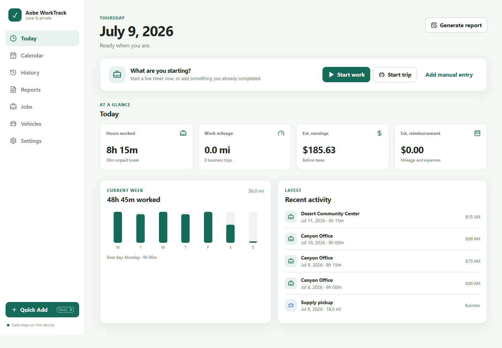

# Aobe WorkTrack

**Hours, mileage, and work records without the paperwork swamp.**

Aobe WorkTrack is a local-first work-hours, break, mileage, expense, report, and backup application. The same React and TypeScript interface runs as an offline-capable web/PWA and as a Tauri 2 Windows desktop application backed by SQLite. Aobe never needs Node.js, Python, Rust, SQLite, a command prompt, an account, or an API key to use a packaged release.



## What it does

- Start, recover, and end live work shifts, paid or unpaid breaks, and mileage trips.
- Add duration-only or time-based shifts, including midnight and multi-day work.
- Record mileage by odometer or direct distance; retain the exact historical rate.
- Reuse optional jobs, projects, locations, rates, tags, and vehicle odometers.
- Estimate regular, daily/weekly overtime, double-time, flat pay, bonuses, tips, mileage, tolls, parking, and reimbursable expenses.
- Review day/month calendar details and searchable, sortable history.
- Soft-delete and restore important records.
- Preview and export PDF, XLSX, CSV, printable HTML, and complete JSON backups.
- Validate imported backups and CSV rows; skip likely duplicates; neutralize spreadsheet-formula injection.
- Keep up to ten local safety snapshots and create one automatically each day with records.
- Load and remove clearly labeled demonstration data.
- Use light, dark, system, high-contrast, large-text, keyboard, and reduced-motion modes.

No analytics, trackers, advertising, login, cloud database, external API, or hard-coded government mileage rate is included.

## Technology

- React 19, TypeScript, Vite
- IndexedDB through Dexie for web/PWA data
- Tauri 2 and parameterized SQLite for Windows desktop data
- Vite PWA/Workbox for offline shell and update prompts
- jsPDF, SheetJS, and Papa Parse for exports/imports
- Vitest, Testing Library, fake-indexeddb, and Playwright

The UI and business logic depend on `StorageAdapter`, not directly on either database. Domain calculations live in `src/domain`; persistence lives in `src/storage`; export/import/backup code lives in `src/services`.

## Use a release (no development tools)

For a normal Windows installation, run `Aobe-WorkTrack-Setup-1.0.0.exe` and follow the short installer. The app installs for the current user, adds a Start Menu shortcut, opens without a terminal, and preserves the private database during ordinary upgrades.

For portable use, run the executable inside `Aobe-WorkTrack-Portable-1.0.0`. The executable is portable; records remain in the current Windows user's application-data folder, so use **Back Up Now** when moving between computers.

The PWA can be opened from a deployed URL and installed using the browser's **Install app** command. After its first successful load, the application shell works offline.

## Developer setup

Requirements for developers only: Node.js 22+, npm, Rust stable, and the Windows prerequisites listed in [BUILD_WINDOWS.md](docs/BUILD_WINDOWS.md).

```powershell
npm ci
npm run dev
```

Open `http://127.0.0.1:5173`. Development data is local to that origin.

### Commands

```powershell
npm run typecheck
npm run lint
npm run format:check
npm test
npm run test:e2e
npm run build
npm run tauri:dev
npm run tauri:build
```

Generate icons once after changing `public/icon.svg`:

```powershell
npm run icons
```

## Web build and Vercel

`npm run build` creates the production web app in `dist/`. `vercel.json` provides the SPA fallback and security headers. Import the Git repository in Vercel with the Vite preset, build command `npm run build`, and output directory `dist`. No environment variables are required. See [DEPLOY_VERCEL.md](docs/DEPLOY_VERCEL.md).

## Windows build and release

`npm run tauri:build` produces an NSIS installer under `src-tauri/target/release/bundle/nsis/` and the release executable under `src-tauri/target/release/`. `scripts/package-release.ps1` renames and assembles those artifacts, the web build, guides, and SHA-256 checksums under `release/`.

The Windows release workflow builds on `windows-latest`, verifies artifacts, uploads them, and optionally attaches them to a `v*` GitHub Release. See [BUILD_WINDOWS.md](docs/BUILD_WINDOWS.md).

## Data storage and recovery

- Web/PWA: IndexedDB database `aobe-worktrack`, isolated to the exact site and browser profile.
- Windows desktop: SQLite database `aobe-worktrack.db` in Tauri's per-user application-data location.
- Active timers: ordinary saved records with canonical ISO timestamps. Reload/restart calculates elapsed time from the timestamp; it never depends on animation ticks.
- Backups: JSON envelopes with a version, timestamp, all state, and SHA-256 integrity hash.

Web and desktop data do not automatically synchronize. Clearing browser site data can delete web records. Export a complete backup regularly. See [BACKUP_AND_RESTORE.md](docs/BACKUP_AND_RESTORE.md).

## Import and export

- Complete JSON backup: every record and preference, integrity checked before restore.
- CSV import: shift or mileage rows, header matching, preview, warnings, duplicate detection, and a pre-import snapshot.
- PDF: titled report, totals, details, estimate disclaimer, optional signature, and page numbers.
- XLSX: Summary, Shifts, Breaks, Trips, Expenses, Vehicles, and Jobs worksheets with dates and numbers stored as real typed values.
- CSV: separate shift and trip files with formula-injection protection.
- HTML: self-contained, printable report.

Imported text is never executed or rendered as raw HTML. Import size is limited to 25 MB.

## Project layout

```text
src/app             application shell and state store
src/components      accessible reusable controls
src/domain          typed records and calculations
src/features        dashboard, calendar, history, reports, profiles, settings
src/services        backup, demo, import, export, and file handling
src/storage         IndexedDB and SQLite adapters
src-tauri           desktop shell and capabilities
tests               unit and integration tests
e2e                 browser workflows
docs                user, privacy, data, build, and deployment guides
scripts             release packaging and smoke checks
.github/workflows   CI and Windows release automation
```

## Privacy, GPS, and limitations

The production app sends no user data anywhere. GPS is intentionally not enabled in 1.0 because reliable, consent-visible background tracking cannot be guaranteed consistently across the supported browser and desktop environments; manual odometer and distance entry remain fully functional. Receipt-image attachments are not included in 1.0. Notifications depend on browser/Windows permission and may pause when the app is closed. The project does not calculate payroll taxes and is not payroll, tax, or legal software.

Unsigned local Windows builds may show the standard Windows reputation warning. Production distribution should code-sign the installer.

## Troubleshooting

- Blank or stale web page: reload once while online so the latest offline shell can activate.
- Browser records missing: confirm the same URL and browser profile; origins have separate IndexedDB storage.
- Export did not appear: allow downloads for the site or choose another file path in desktop mode.
- Windows app will not open: install current Windows updates/WebView2; packaged releases use the WebView2 bootstrapper if needed.
- Restore rejected: do not edit the backup; its hash detects accidental modification.
- Build fails at icons: run `npm run icons` before `npm run tauri:build`.

## Release process

1. Update `package.json`, `src/config.ts`, `src-tauri/tauri.conf.json`, and `src-tauri/Cargo.toml` to the same version.
2. Run all quality commands above and test keyboard/mobile workflows.
3. Build icons and the Tauri installer on Windows.
4. Run `./scripts/package-release.ps1 -Version 1.0.0`.
5. Verify installation, launch, exports, restore, and `release/checksums.txt` on a clean Windows user account.
6. Tag `v1.0.0` to run the release workflow.

## Documentation

- [User guide](docs/USER_GUIDE.md)
- [Backup and restore](docs/BACKUP_AND_RESTORE.md)
- [Windows build](docs/BUILD_WINDOWS.md)
- [Vercel deployment](docs/DEPLOY_VERCEL.md)
- [Data model](docs/DATA_MODEL.md)
- [Privacy](docs/PRIVACY.md)

## License

MIT. See [LICENSE](LICENSE).
